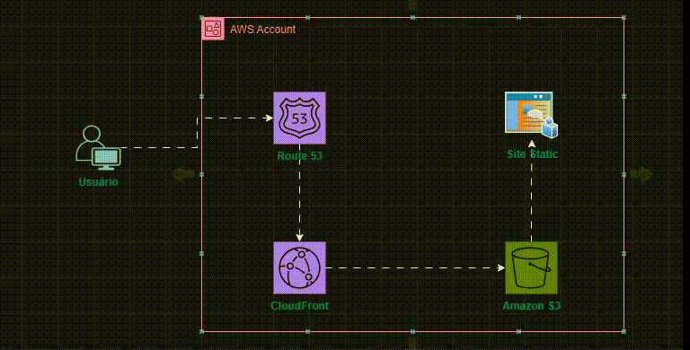

# Hospedando um site estático na AWS usando Amazon CloudFront, Amazon S3 e Amazon Route 53

Este projeto consiste na criação de um site estático hospedado na AWS usando CloudFront, Amazon S3 e Route 53. O site é acessado através de um domínio personalizado e aproveita a distribuição de conteúdo global do CloudFront para oferecer baixa latência e alta disponibilidade.

[Clique aqui](http://sebastiansouza.cloud/) para acessar o link do site!

**Se por acaso o domínio não estiver disponivel por favor acessar os do cloudfront abaixo:**

[Clique aqui](https://d3frqvunb58yu4.cloudfront.net/) para acessar o link alternativo do site! 

## O que foi feito

- Implantação de um site estático em um bucket do Amazon S3.
- Configuração de uma distribuição do CloudFront para servir o conteúdo do site globalmente.
- Associação de um domínio personalizado ao site estático usando o serviço Route 53.

## Como funciona

O conteúdo do site é armazenado no Amazon S3 e distribuído globalmente pelo CloudFront, garantindo tempos de carregamento rápidos e alta disponibilidade. O Route 53 gerencia o roteamento de DNS para o domínio personalizado, proporcionando uma experiência de usuário mais confiável.

## Extensões e Usos Adicionais

Este projeto pode ser estendido de várias maneiras, como adicionar recursos de segurança, implementar SSL/TLS para conexões seguras, ou integrar serviços adicionais da AWS, como AWS Lambda ou AWS Amplify, para funcionalidades avançadas de backend.

## Obrigado
